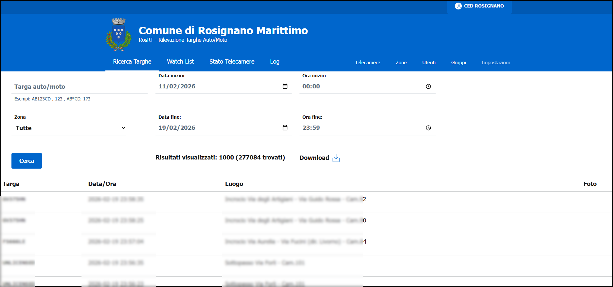

# RosRT
## An ALPR/ANPR service for car plates reporting and email/telegram notification

This is a web application I created for Comune di Rosignano Marittimo for its multiple different ALPR/ANPR video surveillance systems, allowing a centralized portal for managing reporting, watchlists and notifications.

- Fetches ALPR/ANPR car plates data via FTP from multiple camera sources
- Supports Axis / Dahua / Hikvision cameras (tested only with some models)
- Can configure multiple camera groups and users groups
- Can configure plates watchlists for each user group
- Can send detected plates notifications to e-mail and/or telegram recipients
- Supports MFA authentication (only via TOTP)
- Logs every user activity for privacy/legal purposes

Written in PHP using MariaDB, PHPmailer and BootStrap

Uses [Developer-Italia][(https://developers.italia.it) bootstrap web-template

Enjoy !

TODO: A very lot of things! (at least an installation manual :disappointed_relieved: )

